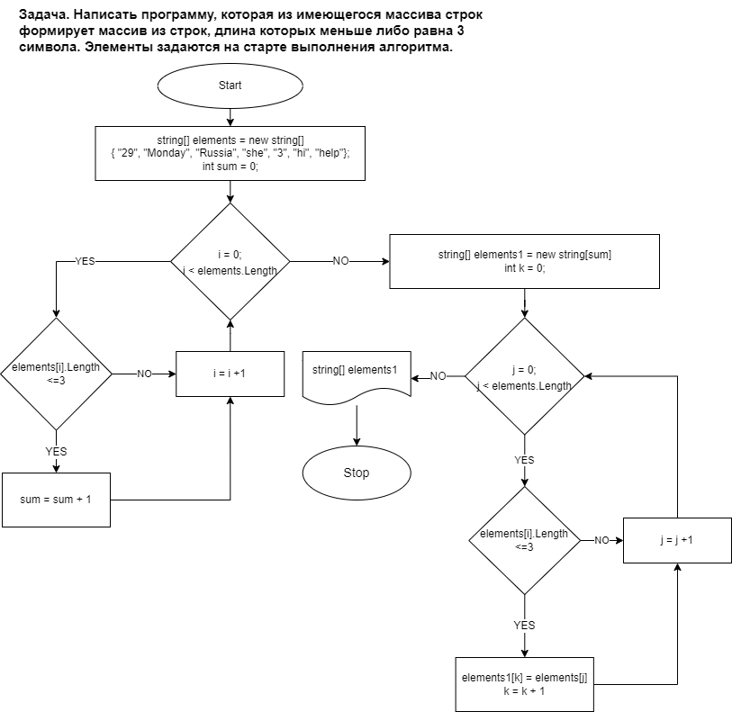

1. Для решения задачи задаём массив типа string и в программе задаём в него произвольные элементы; 
2. Определяем число элементов ещё не заданного массива, согласно условию (длина элемента меньше или равна 3);
3. Создаём 2-ой пустой массив с длинной, определённой в предыдущем пункте;
4. Присваем поочерёдно каждому элементу 2-ого массива, значение элементов 1-ого массива, согласно условию (длина элемента меньше или равна 3);
5. Условие задачи выполнено, 2 массив задан согласно условию и выведен на экран

Во втором варианте решения задачи, использовалось условие дополнительного ввода от пользователя длины и всех элементов массива;
Решено как дополнительное блок-схема представлена для основного решения.

* По условиям итогового проекта: ссылка на репозиторий https://github.com/AndrewDya/Sem1.git
* Блок схема вложена в текущий файл Read.md как файл HW.png
* Текстовое решение описано выше
* Написана программа и протестировано решение
* Использовано несколько коммитов и дополнительная ветка second для решения задачи с иным условием
